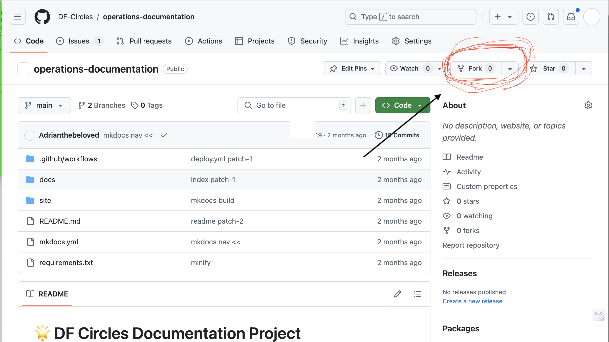
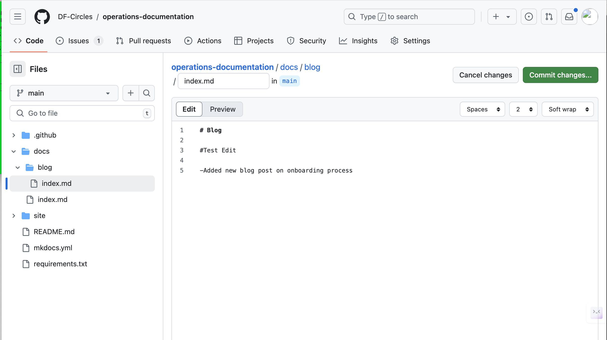
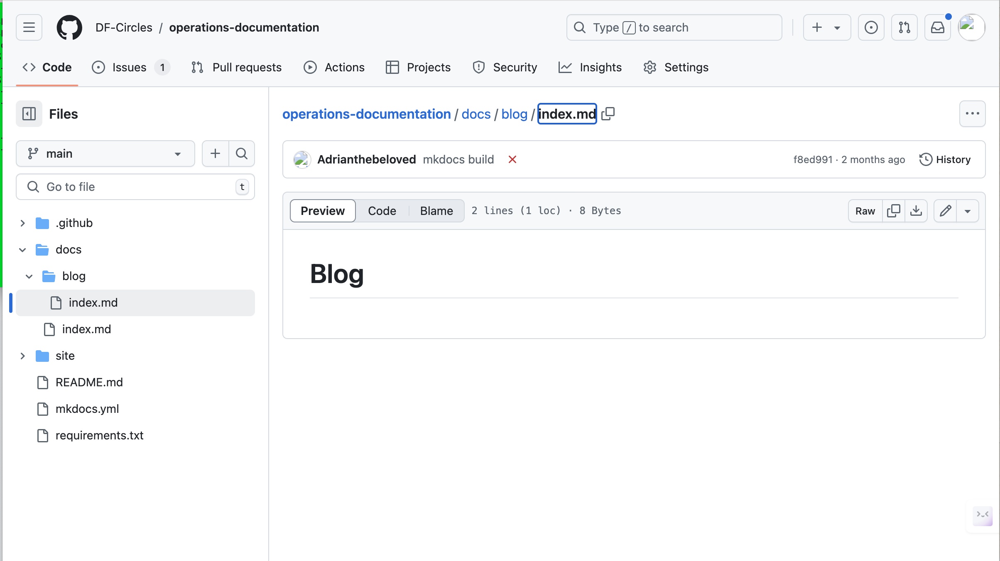
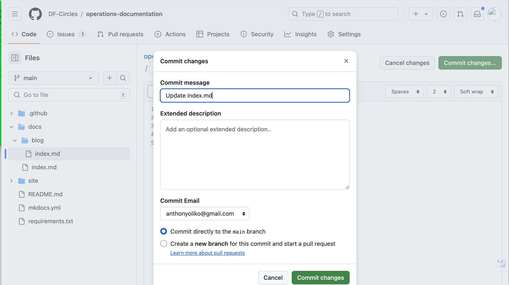

# 🌟 DF Circles Documentation Project

Welcome to the DF Circles Documentation repository! This project aims to create a unified, open-source documentation platform for all Circles within our organization. By using MkDocs, we’re building a centralized, collaborative, and structured resource that ensures consistency, simplifies onboarding, enhances knowledge retention, and clarifies roles across all Circles.

Go to the site: [Here](https://df-circles.github.io/operations-documentation/)

## 🚀 Project Goals

Among other goals to be outlined in the future, The DF Circles documentation project is designed with the following objectives in mind:

1. **Consistency**: Establish standardized processes for all Circles, so that every team member follows clear, documented workflows.
2. **Onboarding**: Provide easy-to-follow resources for new members, making their transition into the Circles smoother and faster.
3. **Knowledge Retention**: Preserve and maintain important knowledge within each Circle, minimizing the impact of member turnover.
4. **Accountability**: Clearly define roles and responsibilities, helping all Circle members understand and own their contributions.
5. **Process Improvement**: Enable Circles to identify potential efficiencies and areas for process enhancement as documentation grows.

With contributions from all Circle members, this project will serve as a valuable reference for current and future teams.

## 🏁 Getting Started

To get started with the DF Circles Documentation project, follow these basic setup instructions.

### Prerequisites

- **Python 3.6+**: MkDocs requires Python 3.6 or higher.
- **MkDocs**: Install MkDocs by running the command below.

### 🖥 Setup on your local machine

1. **Clone the repository**:
   ```bash
   git clone https://github.com/DF-Circles/operations-documentation.git
   cd operations-documentation
   ```

2. **Install dependencies**:
   ```bash
   pip install -r requirements.txt
   ```

3. **Run the local server**:
   Start the MkDocs server to view the documentation in your browser.
   ```bash
   mkdocs serve
   ```
   This will launch the documentation locally at `http://127.0.0.1:8000`.

## 🤝 Contributing

We welcome contributions from all Circle members to help grow and improve this documentation resource. Here’s how you can contribute:

1. **Fork the repository** and create a new branch for your changes.
2. **Follow the structure** outlined in the documentation. Try to use consistent formatting, naming conventions, and section organization.
3. **Submit a Pull Request (PR)** with a clear description of the additions or changes made.

---

## 🤝 Contributing to the Repository via GitHub Web Interface  

This guide explains how to contribute to the MkDocs repository for the DF Circles Documentation using the GitHub web interface, without requiring local setup.

---

## Prerequisites  
1. A GitHub account.  
2. Familiarity with Markdown syntax and basic GitHub functionality.  
3. Access to the repository where changes will be made.

---

## Contribution Workflow  
Follow the steps below to contribute to the repository and open a pull request.

---

### Step 1: Fork the Repository  
1. Navigate to this [repository page](#https://github.com/DF-Circles/operations-documentation) on GitHub.  
2. Click the **Fork** button at the top-right of the page to create your own copy of the repository.  
   
   

---

### Step 2: Navigate to the Desired File or Create a New File  
1. In your forked repository, browse through the `docs/` folder to locate the file you wish to edit.  
   - For example:  
     - To add a new blog post, navigate to `docs/blog/`.  
     - To edit the main website page, go to `docs/index.md`.  
2. If the file does not exist, navigate to the directory where it belongs and click the **Add file > Create new file** button. The new file can also be media content which will be stored in the `images` folder and referenced in the file.

   

---

### Step 3: Edit the File  
1. Click on the file you want to edit.  
2. Press the **Edit this file** pencil icon in the top-right corner.  
3. Make the necessary changes using Markdown syntax.  
   - For example, if you're creating a blog post:  
     ```markdown
     # Title of Your Blog Post  
     Content goes here. You can use Markdown syntax for formatting.  
     ```
4. Scroll down and add a commit message in the **Commit changes** section, describing the changes you made (e.g., "Added new blog post on onboarding process").  
5. Choose **"Create a new branch for this commit and start a pull request"**.  

   

---

### Step 4: Open a Pull Request  
1. After committing your changes, GitHub will redirect you to the Pull Request page.  
2. Review the changes in the **Files changed** tab to ensure everything is accurate.  
3. Fill out the Pull Request description with:  
   - The purpose of your changes.  
   - Any specific information for reviewers.  
4. Click **Create pull request**.  

   **Screenshot suggestion**: Add a screenshot of the pull request form, highlighting the title and description fields.

   

---

### Step 5: Collaborate and Address Feedback  
1. Repository maintainers will review your pull request.  
2. If there are requested changes, navigate back to your fork, edit the necessary files, and commit the changes.  
   - These updates will automatically appear in your open pull request.  
3. Once approved, your changes will be merged into the main repository.  

---

## Adding New Files to Specific Sections  
Here’s where to add content in the repository:  
- **`docs/blog/posts/`**: Add blog articles. Create a new `.md` file for each post.  
- **`docs/index.md`**: Update the main landing page content.  
- **Other Directories**: Add new documentation as required, based on the repository structure.

---

## Tips for a Good Contribution  
- Follow existing formatting and structure.  
- Test Markdown rendering using a Markdown editor or preview it in GitHub.  
- Keep your commit messages clear and descriptive.  

---

By following this guide, you'll ensure a smooth and collaborative contribution process to the DF Circles MkDocs repository.

---

Let me know if you'd like me to refine any part of this or add more details!